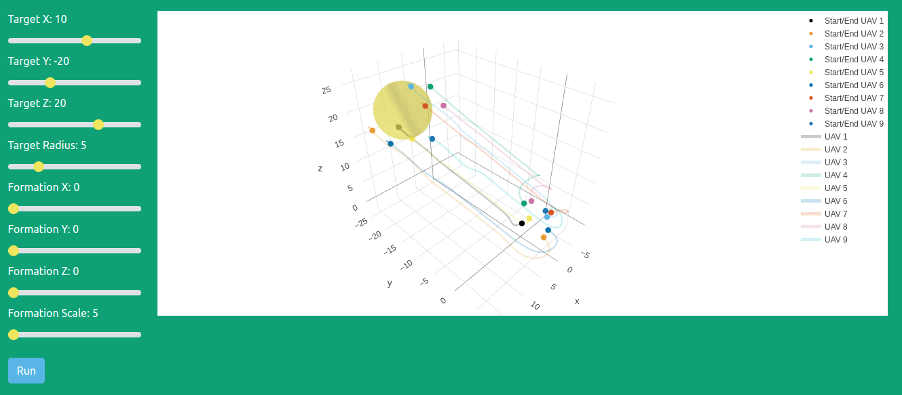

# Flux Guided Flight Simulator

Simulate the motion of a formation of UAVs tasked with surrounding a remote target.

Flux guiding is formation control algorithm for guiding formations of UAVs toward a remote target. The algorithm is packaged [here](https://github.com/jasminium/formationplanning) 

Trajectories are generated by maximizing the sum of an electric field or flux across formation's surface generated by a remote target. Since the electric field is harmonic the formation orientates itself toward the target and tracks it. The formation maintains optimal coverge of the target.

Typically formation control algorithms must solve a high dimensional optimisation algorithm to generate trajectories. Flux guiding is different. The domain is low dimensional since only the UAVs on the front face of the formation are required to measure the flux across the formations surface. This makes the algorithm ideal to generate trajectories for a large number of UAVs.

# Cite

Check out our paper

[John Hartley, Hubert P. H. Shum, Edmond S. L. Ho, He Wang, Subramanian Ramamoorthy - Formation Control for UAVs Using a Flux Guided Approach](https://arxiv.org/abs/2103.09184)
